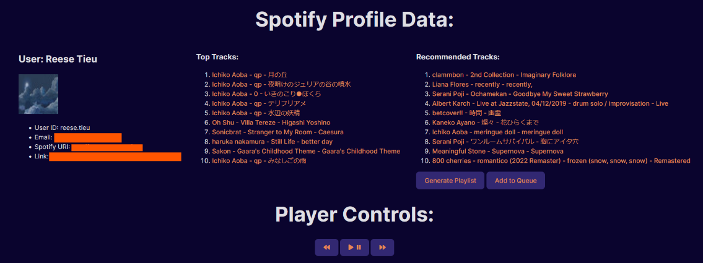

# MusiRecs

Song recommender based on Spotify API with profile display

Song recommender website created in Vite/React.

Requires some setup to get API running. Steps are outlined clearly at [https://developer.spotify.com/documentation/web-api/tutorials/getting-started](https://developer.spotify.com/documentation/web-api/tutorials/getting-started). You will need to update the "clientID" in the script.

Compiles with:

```
npm run dev
```
This program runs on port 5173 on your local machine.

Sample profile:


